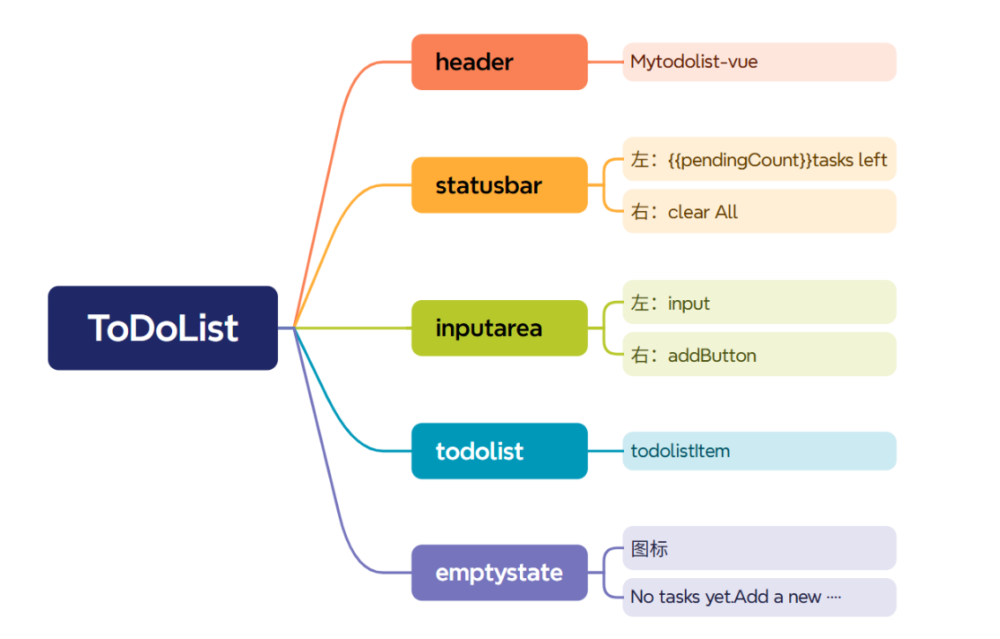
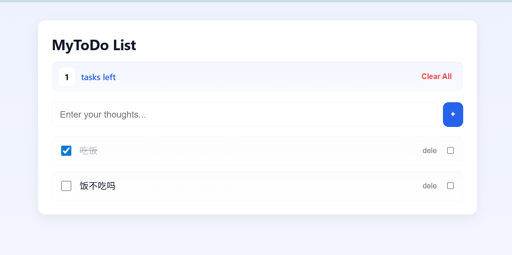

## 创建项目

`npm create vite@latest my-todo --template react`
`cd my-todo`
`npm install`
`npm run dev`

## 项目组件框架

## 完成顺序

1. `type/index.tsx`定义类型
2. `App.tsx`全局状态+逻辑
   - todos 数组
   - 添加 todo 方法
   - 删除 todo 方法
   - 切换完成状态方法
   - 清空方法
3. `InputArea.tsx`输入框+添加按钮
   - 输入文字
   - 点击+号调用 addTodo
4. `TodoItem.tsx`每一条任务
   - 显示文字
   - 显示完成状态
   - 单个删除按钮
5. `TodoList.tsx`渲染 TodoItem 列表
6. `StatusBar.tsx`剩余数量+清除按钮
7. `EmptyState.tsx`无任务时候显示
8. `Header.tsx`标题组件
9. 完成 css 样式

## 完成

